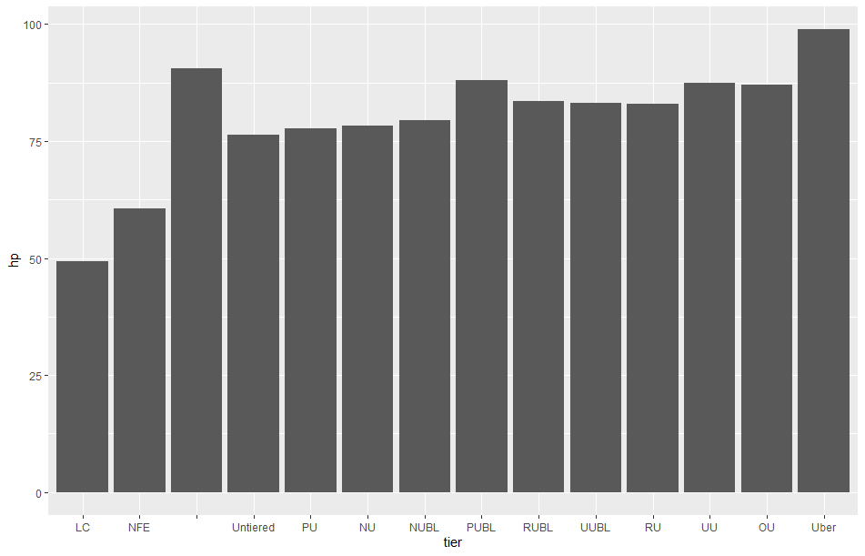

```{r setup, include=FALSE}
knitr::opts_chunk$set(echo = TRUE)

pokemon<-read.csv("pokemon.csv")
pokemon7<-pokemon[-which(pokemon$gen=="VIII"),]

generateTeam <- function(tier, firstChoice){
  workingTier <- pokemon7[which(pokemon7$tier == tier),]
  workingTier <- workingTier[which(workingTier$english_name!=firstChoice),]
  
  pokemonList<-pokemon7[0,]
  pokemonList[1,]<-pokemon7[which(pokemon7$english_name==firstChoice),]

  typeResistances<-c(as.numeric(pokemonList[1,]$against_bug), as.numeric(pokemonList[1,]$against_normal), as.numeric(pokemonList[1,]$against_fire), as.numeric(pokemonList[1,]$against_water), as.numeric(pokemonList[1,]$against_electric), as.numeric(pokemonList[1,]$against_grass), 
                     as.numeric(pokemonList[1,]$against_ice), as.numeric(pokemonList[1,]$against_fighting), as.numeric(pokemonList[1,]$against_poison), as.numeric(pokemonList[1,]$against_ground), as.numeric(pokemonList[1,]$against_flying), as.numeric(pokemonList[1,]$against_psychic),
                     as.numeric(pokemonList[1,]$against_rock), as.numeric(pokemonList[1,]$against_ghost), as.numeric(pokemonList[1,]$against_dragon), as.numeric(pokemonList[1,]$against_dark), as.numeric(pokemonList[1,]$against_steel), as.numeric(pokemonList[1,]$against_fairy))
  
  dotprods<- function(x){
    x1<-as.numeric(x[36])*typeResistances[1]
    x2<-as.numeric(x[25])*typeResistances[2]
    x3<-as.numeric(x[26])*typeResistances[3]
    x4<-as.numeric(x[27])*typeResistances[4]
    x5<-as.numeric(x[28])*typeResistances[5]
    x6<-as.numeric(x[29])*typeResistances[6]
    x7<-as.numeric(x[30])*typeResistances[7]
    x8<-as.numeric(x[31])*typeResistances[8]
    x9<-as.numeric(x[32])*typeResistances[9]
    x10<-as.numeric(x[33])*typeResistances[10]
    x11<-as.numeric(x[34])*typeResistances[11]
    x12<-as.numeric(x[35])*typeResistances[12]
    x13<-as.numeric(x[37])*typeResistances[13]
    x14<-as.numeric(x[38])*typeResistances[14]
    x15<-as.numeric(x[39])*typeResistances[15]
    x16<-as.numeric(x[40])*typeResistances[16]
    x17<-as.numeric(x[41])*typeResistances[17]
    x18<-as.numeric(x[42])*typeResistances[18]
    
    return(x1+x2+x3+x4+x5+x6+x7+x8+x9+x10+x11+x12+x13+x14+x15+x16+x17+x18)
  }
  

  for (i in 2:6){

    pokemonList[i,]<- workingTier[which.min(apply(workingTier, 1, dotprods)),]
    
    workingTier<-workingTier[(which(workingTier$english_name != pokemonList[i,]$english_name)),]
    
    typeResistances<-typeResistances * c(pokemonList[i,]$against_bug, pokemonList[i,]$against_normal, pokemonList[i,]$against_fire, pokemonList[i,]$against_water, pokemonList[i,]$against_electric, pokemonList[i,]$against_grass,
                                         pokemonList[i,]$against_ice, pokemonList[i,]$against_fighting, pokemonList[i,]$against_poison, pokemonList[i,]$against_ground, pokemonList[i,]$against_flying, pokemonList[i,]$against_psychic,
                                         pokemonList[i,]$against_rock, pokemonList[i,]$against_ghost, pokemonList[i,]$against_dragon, pokemonList[i,]$against_dark, pokemonList[i,]$against_steel, pokemonList[i,]$against_fairy)
  }
  
  return(pokemonList)

}
  
```

\maketitle


\newpage
\section{Introduction}

Pokemon was created by Nintendo for release in 1996. It has grown into the largest multimedia intellectual property around. It has spawned television shows, movies, trading cards, merchandise, and more. It has grown into something of a cultural juggernaut, and few people are unaware of it. Thanks to the wide-spread embracing of the franchise, many people played the games as children, and grew to work with it within their academic fields; thanks to this, there is a quantity of research about it [@zielke]. Much of the research centers around the automation of the increasingly complex competitive environment; there are many complex decisions involved in competitive play. 

Pokemon is a game franchise that centers around the capture of naturally-occurring “monsters” called Pokemon, and their use in battles. They replace animals and some plants in the Pokemon world. Those that catch and battle with Pokemon are called trainers. Each Pokemon has one or two “types” which represent their characteristics in some way; for example, there are bug types, flying types, psychic types, ghost types, etc; 18 in all. Each Pokemon then has six stats (Hit points, attack, defense, special attack, special defense, and speed), one ability (of up to three), a nature (which determines one stat to be 10% higher and one to be 10% lower), individual values (values of 0-31 for each stat that represents a unique bonus to the stat), effort values (which are points that can increase a stat gained through training), and a set of four moves which are learned from a pool of moves learned through growth (though moves can also be learned through technology or tutors). A team consists of 6 Pokemon. 

Pokemon battles considered in this paper will be of the single battle format. There are many others: double battles, wherein each Trainer uses two Pokemon at a time; triple battles, wherein one uses three at a time; rotation battles, wherein each Trainer has three Pokemon out at a time and only one active, with the ability to rotate which is active; and finally, inverse battles, which are singles battles whereing the type matchups are all reversed. In competitive play in the generation in question, which consists of Pokemon from every game up until Pokemon Sun and Moon, the decision schema consists of choosing whether or not to switch out, following by whether or not to use limited resources if available, such as Mega Evolution or Z-Moves, followed by choice of which move to use. The move choice is then determined by whether to use some status move or a damage dealing move; for example, there are moves that can increase the user’s stats, decrease the foe’s, add a status condition, add field effects, and more. Some Pokemon are considered to be quite competitive because of their access to those moves. The goal of this project is to create a function capable of creating a well-balanced competitive Pokemon team. 

\section{Literature Review}

Pokemon was created by Satoshi Tajiri, and based around his love of collecting bugs as a child [@bainbridge]. Pokemon plays in some ways into the Japanese culture of the existence of monsters, as they are rather prevalent in the broader Japanese cultural context, from the old legends of things like Kitsune, Kappa, or Tanuki, to the kaiju created like Godzilla, Gamera, Rhodan, etc [@bainbridge]. Pokemon has something of the ideals of environmental conservation as well as consumerism; Pokemon are seen as creatures that should be respected and protected, as well as used in battle, as they are portrayed as happiest when working with a Trainer [@bainbridge]. Environmental issues have been a focal point of several pieces within the Pokemon franchise; in fact, in Pokemon Ruby and Sapphire, there were teams competing, one planning to flood the world to make it a world “for Pokemon,” and the other attempting to dry up the oceans to make way for human expansion, which are in some ways the opposite ends of the spectrum with which we can view the environment. The franchise was created in a space of philosophical tension, between the then focus on economic growth and the animist focus of pre-industrialization Japan [@bainbridge]. Pokemon also faces the context of the 1992 Earth Summit in Rio de Janeiro where biodiversity was recognized for its importance in the environment, something which the Japanese government had largely failed to protect in spite of other environmental protections [@bainbridge]. However, while Pokemon is at first glance a text focused on acquisition and use, the narratives within the media are focused on relationships of “mastery and mutual respect” that are focused on a healthy relationship between humans and the environment [@bainbridge]. 

Many of the Pokemon designed within the franchise are focused around the applications of the fantastical mechanics and premise to real world animals. For example, many bug type Pokemon are relatively easily classified into real world insect taxonomies, excluding the fact that many likely belong in arthropoda [@schmidt]. The Pokemon within these taxonomies have stats that represent the known aspects and behaviors of those taxonomies in the real world, for the most part; barnacle-related Pokemon are hardy, those in mantodea are offensively-equipped [@schmidt]. The goal of such an examination is to examine the utility of Pokemon in introducing a non-academic audience to insects, which could be more broadly applied to more Pokemon [@schmidt]. Many of them are based entirely on real world physiologies, such as Pokemon like Burmy, and due to how recognizable Pokemon are, means that they can be valuable educational resources [@schmidt]. Pokemon names are also frequently puns based on the qualities of the real world animal as well as the Pokemon’s characteristics, another aspect that lends itself towards a valuable media franchise in the cultural awareness that Pokemon finds itself in [@schmidt]. Pokemon have very distinct features that can even be used somewhat within the Darwinian evolution approach, though it does not perfectly encapsulate the present species [@phylogeny]. The approach of this classification is interesting because of the authors’ choice to work within the framework; the concert of many of the Pokemon games is that the player character is recruited as a Professor’s assistant in cataloguing the species of Pokemon that exist in each region [@phylogeny]. However, the player character still takes part in a competitive League or Challenge of some sort. The taxonomical approach shows the utility of such a large franchise within the context of people’s relationship to nature; similar to the real world, the world of Pokemon presents an environment that changes with human activity and how that affects the Pokemon species (for example, the evolution of a sentient bag of garbage, Trubbish) [@phylogeny]. 

Some of this discussion is somewhat lost when pivoting towards competitive play. The ideals of mastery and mutual respect do not matter much in the online context of optimized play using the Pokemon [@zielke]. Pokemon within the competitive framework takes on a very different gameplay paradigm. It is focused on assembling the best teams, to beat and out compete other actual players [@zielke]. The textual understandings of the game matter a significant amount less when focused on gameplay like this; instead, Pokemon are akin to pieces on a chessboard [@zielke]. The focus changes from the development of mutual respect to renewed focus on the “dog-fighting” focus of the games, and is therefore a divorced textual context [@zielke]. Instead of growth, the goal is victory [@zielke]. 

Pokemon is well designed for its purpose; refinement of the format shows that for the intended audience, it has an optimal number of Pokemon per Trainer [@settings]. Experts may prosper with five and beginners more with seven, but for the overall audience, six Pokemon per trainer appears to be optimal [@settings]. The bases for this is the number of branches in the decision tree as well as length of game, or turns - by optimizing “acceleration of information” for different audiences represented by different AI’s, one finds that 6 is the most appealing to most players, but other formats may occasionally be better [@settings]. 

Pokemon automation is somewhat different than the automation of other competitive games. Instead of split-second decisions, much of the competitive experience is focused on slower critical thinking; the decisions of one’s opponent are extremely important, and so the average player needs to instead think about what they expect their opponent to do [@zielke]. For example, s imple MinMax algorithm struggles in the context of Pokemon battles; it can be used for one versus one Pokemon battles, but would struggle to keep up with a full team battle [@minmax]. The problem is that the game state expands exponentially; not only that, the metric of HP remaining is not the most reliable; there are all kinds of situations where it may not be the most optimal choice [@minmax]. For example, against a stall team, which is a team comprised of Pokemon with high defensive stats and status moves meant to wear the enemy own over time, there are different tactical choices that one might make than against a hyper-offensive sweeping team, which is a team comprised of fast and strong Pokemon. However, in a limited choice state, the MinMax algorithm can select an optimal move [@minmax]. This represents in many ways the simplest algorithm that can be applied to Pokemon battling. Within this specific algorithm, the tree of decisions also uses knowledge of the other Pokemon’s decision; one of the examples is a one on one battle between a Breloom and a Crobat [@minmax]. The Crobat, having moves that are four times supereffective, should use those every time in this context, so there is some variation from what a competitive player would likely do [@minmax]. That same example could be different in a standard singles battle - a competitive player might swap the Breloom for another Pokemon in the party, which would affect the Crobat’s choice of move. 

Since that time, with greater applicability of machine learning, some artificial intelligences have been built capable of performing in a competitive framework. Largely, this has occurred thanks to machine learning - the ability to learn to respond to the many states that can exist in Pokemon. The ability to scrape and feed in a turn by turn state input to a neural network allows for a more full evaluation of state, as a higher tier competitive player might [@huang]. By training on random battles, which is a format on Pokemon Showdown that gives both players a randomized team, an AI can be trained to make optimal choices [@huang]. Against people in random play, such a trained AI attains a 72% win rate, though that is still limited to random play, rather than crafted teams [@huang]. When trained with crafted teams, based around some of the hallmark strategies of the format, the AI was able to effectively compete only with those specific teams, and fell to once again poor performance in randomized battles [@huang]. The AI is, given training in a format, capable of high tier competitive play. However, it is not capable of selecting its own teams; it can be trained to use a couple of teams effectively. 

Recreating the environment can be quite useful; a recreation of a simplified environment can allow for application of other AI models. Pokemon battling can be used to create a randomized framework to allow for evaluation of AI models in a more tightly controlled environment [@reinforcement]. This is a somewhat different approach, as there is effectively no threat list or Pokemon with unique traits; however, using the Pokemon structure to carry competitive attributes allows for a decoupling from competitive meta and planning for and around specific Pokemon; instead, the recreated environment assigns values based on normal distributions and random typings [@reinforcement]. Most notable about this is that it allows for a simplified environment for a specific objective; for example, a focus on switching, which does tend to be a weakness [@reinforcement]. However, the created model is not an effective one for competitive play; Pokemon are not randomly constructed, and lack of stats and established moves does lead to a lack of competitive complexity. 

Teambuilding is one of the most essential skills to compete in Pokemon. Similar to other deckbuidling games that receive attention in optimization, like Magic: the Gathering, there is a wide array of choices, that is only somewhat pared down by community direction of metagame. Part of the craft of building a team is assigning roles to Pokemon - this helps the player know how to use that Pokemon in a battle. For example, a “sweeper” is a Pokemon that is strong and fast, and will typically boost its speed and relevant attacking stat before attempting to knock out a majority of the enemy’s team. A wall is typically a pokemon that is very defensive, usually with moves that lend themselves towards stalling (such as Toxic, which deals damage that doubles every turn), or recovery. Classifying these Pokemon and establishing competitive viability of a team is something that eludes novice competitive battling [@Verdear]. A Pokemon’s role in a team will be determined by its effort values spread, item, moves, species, and Ability. Establishing the role for each Pokemon would be a significant step towards an AI that is capable of playing Pokemon fully on its own.


\section{Data}

The data was downloaded from a Kaggle dataset (Cristobal Mitchell, kaggle.com). The data set contains the english and Japanese names, Pokedex number, Abilities, typing, weaknesses and resistances to types, whether or not it can mega evolve, evolutionary line, as well as in-game Pokedex information, such as description, height, weight, etc, which have no bearing on the competitive schema. Added to this was the Smogon competitive rating, which affects which tiers of competitive play the Pokemon is allowed in. Smogon's ratings are based on there being at least a 50% chance of seeing a Pokemon within 15 battles in a tier, which works out to around 4% usage within a tier. A Pokemon in a tier is unallowed in lower tiers, but allowed in higher tiers. As seen in Figure 1, the tiers also roughly correspond to total stats, so it is a useful framework by which to split up the set of Pokemon. The competitive Smogon tier was added to each Pokemon individually. The progression from weakest to strongest tier is PU, PUBL, NU (NeverUsed), NUBL, RU (RarelyUsed), RUBL, UU (UnderUsed), UUBL, OU(OverUsed), and Uber. Those with BL means ban list, and they are Pokemon that technically fit the category corresponding to the first two letters, but are considered to be too strong for that tier. NFE refers to not fully evolved, which generally means a Pokemon simply would not be used in a tier, and LC refers to little cup, which is a unique format where Pokemon are essentially used right out of the Egg it is hatched from (they all hatch from eggs!). 

In table 1, the OU tier Pokemon in the Pokedex are listed, along with their types and stats. Additionally, one can see some descriptive statistics about the OU tier in Table 2; of note really are the stat spreads. I am rather surprised at how relatively slow the OU tier is (as measured by the mean), due to the importance of speed in Pokemon battles. Addtionally, Steel types are heavily represented. This stands to reason, as Steel is a strong defensive type, and is very strong in the metagame since the introduction of the Fairy type (which is weak to Steel). Grass types are also quite prevalent, and this is surprising compared to prior generations of competitive play. Grass has the one of the most weaknesses of all types. However, in the seventh generation of play, Serperior is quite strong because of its ability to get stronger every turn, and other grass types have seen a boost thanks to newer mechanics like terrain based moves. 

\section{Methods}

In order to create teams that cover type weaknesses, one must in some way calculate a single array of types that has as few weaknesses as possible. To do so, I focused on minimizing the dot product of the array of type resistances starting from a first choice, or "seed" Pokemon to inform the other choices of team members. This is reflective of competitive play where teams are frequently built around a Pokemon that is planned to be the win condition in battles. For example, one might build a team around Serperior that focuses on battlefield conditions that make it easier to sweep with Leaf Tornado. Focusing on type effectiveness does somewhat lose this nuance; for example, Serperior, a Grass type, has many weaknesses in common with Bug types (such as Fire and Flying type moves), but one might use a Bug type for their access to a move that can slow down any Pokemon that switches in for the opponent, allowing the user's team to reliably out-speed. However, novice players can struggle with type effectiveness, simply due to the bookeeping of keeping up with six Pokemon with potentially two types. 

The reason why minimizing the dot product works mathematically for this purpose is that weaknesses have a greater numerical magnitude than resistances when vectorized; a weakness can have a value of 2 or 4, representing a multiplier on the damage of the move, while resistances can have a value of .25 or .5 (or 0 in a few instances), which means that the dot product naturally prioritizes adding a resistance for each weakness. Therefore, thanks to the inherent values for type effectiveness, dot product optimization can effectively cover up type weaknesses. Source code can be found in the Appendix. The objective equation to satisfy is $$min(t_1 * t_2 * t_3 * t_4 * t_5 * t_6)$$ where each $t$ is the type resistance array of a Pokemon on the team. 

\section{Findings}
Findings are not terribly surprising. We see that Steel types are somewhat over-represented, which makes sense because of their large amount of resistances. Additionally, Fairies are quite defensive, and even take 0 damage from Dragon type moves. The presence of Zapdos being present on several teams is also not entirely surprising - it is Electric and Flying, which makes it immune to Ground type moves, an otherwise very strogn offensive type. Zapdos is also a notable Sweeper. Part of the overlap also has to do with the competitive paradigm; even within competitive play, some Pokemon are seen as quite optimal, like Azumarill, for its typing and strength (note that Azumarill is exclusively used with the Ability Huge Power, which doubles its Attack stat). Additionally, the number of Pokemon within the competitive tiers is not that large (compared to the number of Pokemon), simply due to the way tiers are balanced.

The teams generated do avoid the issue that had been expected to be prevalent: the teams do tend to have at least on Pokemon capable of sweeping, one that is quite defensive, and one capable of status or hazard moves. These are teams that one is likely to see when playing the Generation 7 OU competitive environment. One might lose advanced tactical space in the focus for well roundedness, but in not planning for types in a way similar to this, one leaves a gap on their team that could be taken advantage of. Indeed, even the best players making the best decisions in a match can lose simply because of team composition, which is another factor that pushes rapid turnover in Pokemon tiers.


\section{Conclusion}

Pokemon is well established as a state machine with a wide array of states. The most successful battling AI uses over 1.3 million input parameters for each turn (@reinforcement). That even omits one of the most crucial elements to success, which is effective team building that allows one to counter the threats they are likely to see. Team building is where the revolutionary strategies in competitive Pokemon play occur. A great example of this occurred in the Ubers tier. Kyogre had been extremely prevalent for its power; someone countered with a Grass type Arceus, which was a new choice in team building at that time, and in a highly public match (within the highly competitive Pokemon Showdown scene, anyway), someone unveiled Hidden Power fire on a Mega Gengar, which had not been part of the metagame space before. These are the kinds of creative choices that drive the competitive Pokemon experience. 

Many of these mechanics have been pared away in favor of the newer Dynamax and Gigantimax battle abilities; these just make Pokemon really big and strong for three turns. The mechanics Nintendo have been putting out have tended to focus on shorter effect spaces that offer a mroe intensive resource decision. It is likely that the competitive elements will continue to built on in a similar direction; the ninth generation of games will be Pokemon Scarlet and Violet, and could have anything as a new competitive gimmick, or a return to Mega Evolution. What is clear is that the highly competitive Pokemon Showdown scene has led to Nintendo itself taking note, meaning that new competitive mechanics are likely to be an anchor in Pokemon game design.


\newpage

\printbibliography

\section{Appendix}



```{r}
pokemon7[which(pokemon7$tier=="OU"),c(3:6, 14:20)]
```


% Table created by stargazer v.5.2.2 by Marek Hlavac, Harvard University. E-mail: hlavac at fas.harvard.edu
\begin{table}[!htbp] \centering 
  \caption{OU Tier Dexcriptive Statistics} 
  \label{} 
\begin{tabular}{@{\extracolsep{5pt}}lccccccc} 
\\[-1.8ex]\hline 
\hline \\[-1.8ex] 
Statistic & \multicolumn{1}{c}{N} & \multicolumn{1}{c}{Mean} & \multicolumn{1}{c}{St. Dev.} & \multicolumn{1}{c}{Min} & \multicolumn{1}{c}{Pctl(25)} & \multicolumn{1}{c}{Pctl(75)} & \multicolumn{1}{c}{Max} \\ 
\hline \\[-1.8ex] 
ï..national\_number & 32 & 533.688 & 234.835 & 36 & 430 & 784.2 & 806 \\ 
height\_m & 32 & 1.581 & 1.529 & 0.300 & 0.950 & 1.800 & 9.200 \\ 
weight\_kg & 32 & 93.131 & 184.736 & 0.100 & 21.025 & 78.775 & 999.900 \\ 
base\_egg\_steps & 32 & 11,240.000 & 10,427.870 & 2,560 & 4,800 & 12,800 & 30,720 \\ 
bst & 32 & 543.375 & 53.235 & 420 & 506 & 585 & 600 \\ 
hp & 32 & 86.969 & 33.928 & 50 & 70 & 100 & 250 \\ 
attack & 32 & 92.781 & 32.107 & 5 & 74.2 & 103.2 & 181 \\ 
defense & 32 & 97.219 & 29.526 & 5 & 78.8 & 115 & 152 \\ 
sp\_attack & 32 & 92.656 & 31.280 & 35 & 70.5 & 113.8 & 151 \\ 
sp\_defense & 32 & 90.750 & 22.723 & 31 & 75 & 105 & 142 \\ 
speed & 32 & 83.000 & 26.846 & 20 & 61 & 100.5 & 130 \\ 
\hline \\[-1.8ex] 
\end{tabular} 
\end{table} 

```{r, echo=TRUE, eval=FALSE}
generateTeam <- function(tier, firstChoice){
  workingTier <- pokemon7[which(pokemon7$tier == tier),]
  workingTier <- workingTier[which(workingTier$english_name!=firstChoice),]
  
  pokemonList<-pokemon7[0,]
  pokemonList[1,]<-pokemon7[which(pokemon7$english_name==firstChoice),]

  typeResistances<-c(as.numeric(pokemonList[1,]$against_bug), as.numeric(pokemonList[1,]$against_normal), as.numeric(pokemonList[1,]$against_fire), as.numeric(pokemonList[1,]$against_water), as.numeric(pokemonList[1,]$against_electric), as.numeric(pokemonList[1,]$against_grass), 
                     as.numeric(pokemonList[1,]$against_ice), as.numeric(pokemonList[1,]$against_fighting), as.numeric(pokemonList[1,]$against_poison), as.numeric(pokemonList[1,]$against_ground), as.numeric(pokemonList[1,]$against_flying), as.numeric(pokemonList[1,]$against_psychic),
                     as.numeric(pokemonList[1,]$against_rock), as.numeric(pokemonList[1,]$against_ghost), as.numeric(pokemonList[1,]$against_dragon), as.numeric(pokemonList[1,]$against_dark), as.numeric(pokemonList[1,]$against_steel), as.numeric(pokemonList[1,]$against_fairy))
  
  dotprods<- function(x){
    x1<-as.numeric(x[36])*typeResistances[1]
    x2<-as.numeric(x[25])*typeResistances[2]
    x3<-as.numeric(x[26])*typeResistances[3]
    x4<-as.numeric(x[27])*typeResistances[4]
    x5<-as.numeric(x[28])*typeResistances[5]
    x6<-as.numeric(x[29])*typeResistances[6]
    x7<-as.numeric(x[30])*typeResistances[7]
    x8<-as.numeric(x[31])*typeResistances[8]
    x9<-as.numeric(x[32])*typeResistances[9]
    x10<-as.numeric(x[33])*typeResistances[10]
    x11<-as.numeric(x[34])*typeResistances[11]
    x12<-as.numeric(x[35])*typeResistances[12]
    x13<-as.numeric(x[37])*typeResistances[13]
    x14<-as.numeric(x[38])*typeResistances[14]
    x15<-as.numeric(x[39])*typeResistances[15]
    x16<-as.numeric(x[40])*typeResistances[16]
    x17<-as.numeric(x[41])*typeResistances[17]
    x18<-as.numeric(x[42])*typeResistances[18]
    
    return(x1+x2+x3+x4+x5+x6+x7+x8+x9+x10+x11+x12+x13+x14+x15+x16+x17+x18)
  }
  

  for (i in 2:6){

    pokemonList[i,]<- workingTier[which.min(apply(workingTier, 1, dotprods)),]
    
    workingTier<-workingTier[(which(workingTier$english_name != pokemonList[i,]$english_name)),]
    
    typeResistances<-typeResistances * c(pokemonList[i,]$against_bug, pokemonList[i,]$against_normal, pokemonList[i,]$against_fire, pokemonList[i,]$against_water, pokemonList[i,]$against_electric, pokemonList[i,]$against_grass,
                                         pokemonList[i,]$against_ice, pokemonList[i,]$against_fighting, pokemonList[i,]$against_poison, pokemonList[i,]$against_ground, pokemonList[i,]$against_flying, pokemonList[i,]$against_psychic,
                                         pokemonList[i,]$against_rock, pokemonList[i,]$against_ghost, pokemonList[i,]$against_dragon, pokemonList[i,]$against_dark, pokemonList[i,]$against_steel, pokemonList[i,]$against_fairy)
  }
  
  return(pokemonList)
}
```


```{r}
generateTeam("OU", "Serperior")[,c(4:6, 14:20)]
generateTeam("OU", "Kartana")[,c(4:6, 14:20)]
generateTeam("OU", "Greninja")[,c(4:6, 14:20)]
generateTeam("OU", "Toxapex")[,c(4:6, 14:20)]
```


\newpage
\section{Bibliography}


